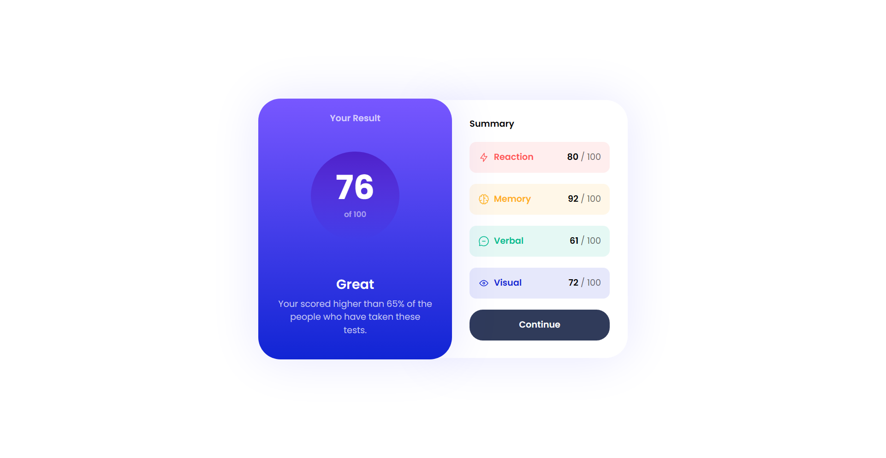

### Contenido

### Links

- GitHub URL: [https://github.com/PieroBryanBL/Summary-FM]
- Live Site URL: [https://pierobryanbl.github.io/Summary-FM/public/]

## Mi tiempo de desarrollo

### Hecho con

- HTML5
- CSS
- Flexbox
- Mobile-first workflow
- Tailwind CSS

### ¿Qué aprendí?

Mi tercer dia técnicamente aprendiendo Tailwind, al parecer la curva de aprendizaje es bastante sencillo y eficiente. He aprendido o mejorado mi entendimiento en Tailwind, tambien a tener ciertas clases personalizadas y poder mejorar la rapidez al desarrollar.

### Desarrollo Continuo

Tengo dificultades con Tailwind debido a que todavia debo manejar temas de su configuracion y clases personalizadas, además que al haber tantas clases puede resultar bastante agobiante y mareable cuando se revisa el código, debo mejorar el orden y optimizar el código.

### Recursos Útiles

- [Recurso Resaltante](https://icons8.com/) - Me ayudó a conseguir un icono para la página, tambien hay muy buenas alternativas pero esta me resultó mejor por ahora.

## Autor

- Frontend Mentor - [Piero Bryan BL](https://www.frontendmentor.io/profile/PieroBryanBL)
- Twitter - [Piero Bryan BL](https://twitter.com/pierobryan_bl1)
- LinkedIn - [Piero Bryan BL](https://www.linkedin.com/in/piero-bryan-benigno-leyva-604775244?lipi=urn%3Ali%3Apage%3Ad_flagship3_profile_view_base_contact_details%3BFNAR%2Fdm%2FSAmeV9ZHidShYA%3D%3D)
